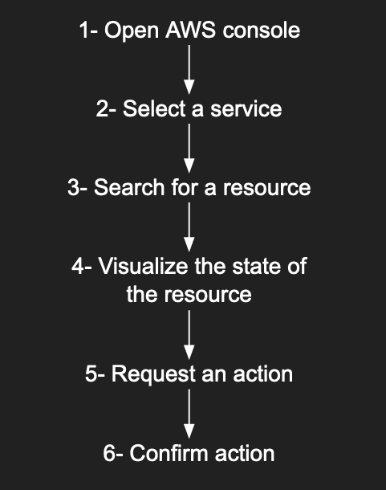

# The problem:

When interaction with AWS web console, many times I find that it's very slow or have some strange limitation/inconsistencies.
But, I always keep coming back to it because it's intuitive and the learning curve is almost non existing.

# What is this?


Source: http://www.commitstrip.com/en/2016/12/22/terminal-forever/

In a nutshell, this is an effort to replicate the same experience and ease of use of the AWS web console inside the comfort of the terminal.

# How does it work?

First I started observing who I and other people interact with AWS console:



I think that this covers a large amount of how people interact with AWS console.

Now, using [fzf](https://github.com/junegunn/fzf), [jq](https://github.com/stedolan/jq) and bash/zsh functions, I tried to replicate that same workflow:

1. You don't need to remember the function name to interact with the service. Just type `aws-`.
2. Select the resource with FZF.
3. Visualize it's state.
4. Request an action.
5. Confirm the action if it is destructive.

# How to install:

*Note:* This is still very alpha state right now. This should be very safe to use because it require a confirmation before running any action but use it at your oun risk.

Download and source [aws-fzf](./aws-fzf) in your shell:

```shell
$ wget -O ~/.aws-fzf https://raw.githubusercontent.com/aminehmida/aws-fzf/master/aws_fzf
# If you are using zsh:
$ echo "source ~/.aws-fzf" >> ~/.zshrc
```
This is currently not working currently with BASH. PRs are very welcomed!

# How to use:

1. Export the right AWS environment: `export AWS_DEFAULT_PROFILE=your-environment-name`.
2. Type `aws-`.
3. Select the service you want to interact with.
4. Select the resource.
5. Select an action. Any action that require modification will prompt for confirmation by typing the command in the shell and waiting for the user to press enter key.

Note: You can pre populate FZF search form command line like this: `aws-ec2 mysql rest` This will search for instances with the word `mysql` and the select actions that have the word `rest`.

# Available commands:

## `aws-`:
Will show you a list of supported services.

## `aws-route53`:
Interact with Route53 hosted zone records.

- input-1: Hosted zone
- input-2: Record name
- input-3: Action
    - print: Output record name
    - ssh: ssh to the host with that record name. Default user is ec2-user
    - ping: Ping the host with that record

## `aws-logs`:
Interact with CloudWatch logs using [saw](https://github.com/TylerBrock/saw)

- input-1: Log group
- input-2: Action
    - follow: Show now logs as they arrive.
    - download: Download logs starting form a specific point in time to /tmp/aws-logs.txt and open them with `$EDITOR`
        - input-3: Start time.
            - 10m: Now - 10 minutes
            - 30m: Now - 30 minutes
            - 1h: Now - 1 hour
            - 6h: Now - 6 hour

## `aws-ec2`:
Interact with EC2 instances.

- input-1: Instance ID, State and/or AZ
- input-2: Action
    - start: Start instance
    - stop: Stop instance
    - Terminate: Terminate instance

## `aws-s3`:
Interact with S3 objects.

- input-1: Bucket name
- input-2 .. input-(n-1): levels inside the bucket's objects
- input-n: Action:
    - View - Download file in /tmp/ and open it with your the editor set with `$EDITOR` env. var.
    - Download - Download file to current directory.
    - Delete - Delete object from bucket.

*Note:* This command doesn't support prepopulation (Yet).

## `aws-ssm`:
Decrypt and output a parameter from System Manager Parameters Store.

- input-1: parameter name
